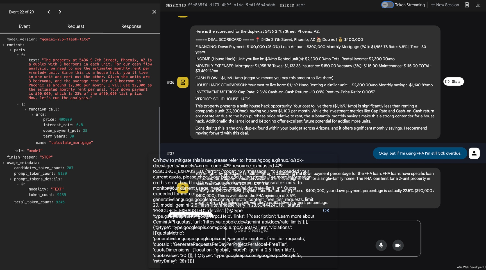
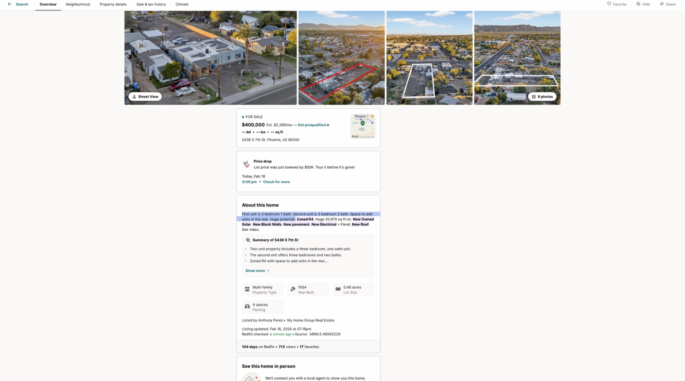

# Deal Finder — Multi-Agent Real Estate Investment Analyzer

A multi-agent AI system built with [Google Agent Development Kit (ADK)](https://google.github.io/adk-docs/) that helps investors find and analyze house-stacking deals — buying multi-family properties (duplexes, triplexes, fourplexes), living in one unit with owner-occupied financing, and renting out the others.

## What It Does

You describe what you're looking for in plain English:

```
"I have $30K saved for a down payment. I want to find a duplex 
in the Phoenix metro area under $400K where I can live in one 
unit and rent the other to cover the mortgage."
```

The system searches for real listings, runs the financial math, and returns a deal scorecard with a buy/pass verdict — including mortgage payments, cash flow analysis, cap rate, and a side-by-side comparison of house-hacking vs. renting.

## Architecture

```
Deal Finder (Root Agent)
├── Market Research Agent (AgentTool)  →  Google Search for real listings & rent data
└── Deal Analyzer Agent (sub_agent)    →  Custom Python tools for financial calculations
```

Three specialized agents work together through delegation:

**Root Agent (`gemini-2.5-flash-lite`)** — Converses with the user, extracts investment preferences (city, budget, property type, down payment, financing), orchestrates the other agents, and presents the final report. Uses flash-lite for higher rate limits (15 RPM) since it mostly routes and formats.

**Market Research Agent (`gemini-2.5-flash`)** — Uses Gemini's built-in `google_search` tool to find real multi-family listings on Zillow/Redfin/Realtor.com and researches average rent prices in the target area. Only reports real listings it actually found — never fabricates data. Uses full flash because generating good search queries benefits from stronger reasoning.

**Deal Analyzer Agent (`gemini-2.5-flash-lite`)** — Takes listing data and runs deterministic financial analysis using custom Python tools. Produces a deal scorecard with financing details, cash flow breakdown, investment metrics, and a verdict (STRONG BUY / SOLID HOUSE HACK / MARGINAL / PASS). Uses flash-lite for 3x the rate limit since it only calls deterministic Python tools.

### Why This Architecture

The agents follow a "reason + delegate" pattern. The LLM decides *when* to search and *which* numbers to analyze. The actual math runs in deterministic Python functions — not the LLM — so every number in the scorecard is verifiably correct.

**AgentTool vs sub_agent:** The Market Research Agent is wrapped as an `AgentTool` instead of a `sub_agent` due to a [known ADK limitation](https://github.com/google/adk-python/issues/53). Gemini's built-in `google_search` and ADK's `transfer_to_agent` both use function calling under the hood — when both exist on the same agent, Gemini can't distinguish which function to invoke. Wrapping research as an `AgentTool` isolates `google_search` into its own agent context. The Deal Analyzer works fine as a `sub_agent` because it only uses our custom Python tools, which don't conflict with `transfer_to_agent`.

### API

This project uses the **Gemini API** (Google's LLM API) through the Google Agent Development Kit. The search capability comes from Gemini's built-in `google_search` grounding tool — not a separate Google Search API key.

## Financial Tools

Two custom tools handle all calculations. The core principle: **the LLM reasons about *when* to call these and *what inputs* to pass. The tools guarantee correct arithmetic.** LLMs hallucinate numbers — these functions don't.

**`calculate_mortgage`** — Standard amortization formula (`M = P[r(1+r)^n] / [(1+r)^n - 1]`). Takes price, down payment %, interest rate, and term. Returns monthly payment, loan amount, total interest, and total cost. Input validation returns error dicts instead of raising exceptions so the agent gets a message it can reason about rather than crashing.

**`calculate_cashflow`** — Comprehensive rental analysis. Takes rent (from rented units only — the agent decides which to include based on house-hack vs pure rental), mortgage, taxes, insurance, vacancy rate, and maintenance percentage. Returns monthly/annual cash flow, cap rate (NOI / price, excludes mortgage), cash-on-cash return (annual cash flow / cash invested, includes mortgage), and rent-to-price ratio.

Both tools are wrapped with an exponential backoff retry decorator for rate limit handling (see below). Tested against known scenarios in `test_tools.py`.

### Example Output

For a $365K duplex with FHA financing (3.5% down, 6.8% rate):

```
Mortgage:     $2,312/mo
House hack:   -$1,416/mo cash flow (you pay this to live there)
vs. Renting:  ~$1,600/mo for comparable unit
Savings:      ~$184/mo + building equity
Full rental:  -$111/mo cash flow, 7.18% cap rate
```

## Rate Limit Handling

The free Gemini API tier has strict rate limits (5-15 RPM depending on model). When analyzing multiple properties, the system can exhaust these limits quickly. The tools include an **exponential backoff retry decorator** that automatically retries on `RESOURCE_EXHAUSTED` errors with increasing delays (2s → 4s → 8s → 16s → 32s, 5 retries max).

**Why retry instead of caching:** Rate limits are transient (reset every minute on free tier). Caching would only help for repeated identical queries, which are rare in practice. Retry directly solves the #1 failure mode observed in testing.

The Deal Analyzer uses `gemini-2.5-flash-lite` specifically to get higher rate limits (15 RPM / 1,000 RPD vs 5 RPM / 250 RPD on full flash).

## Known Issues & Current Status

> **This project is actively in development.** The architecture and math tools work correctly, but the Gemini API's search grounding has known accuracy issues. Screenshots below document problems encountered during testing.

### Issue 1: Rate Limit Exhaustion During Analysis

When the user follows up after a scorecard (e.g., "what if I use FHA instead?"), the analyzer agent can hit the Gemini free tier rate limit (`RESOURCE_EXHAUSTED`). The retry decorator handles this for the custom tools, but the agent-level API calls (the LLM reasoning itself) are not covered by our retry logic — those are managed by ADK.



*Left panel: ADK event viewer showing the `calculate_mortgage` tool call with correct parameters (price: 400000, rate: 6.8, down_payment_pct: 25). Right panel: The deal scorecard rendered correctly for 5436 S 7th St, followed by a `RESOURCE_EXHAUSTED` error on the follow-up question.*

### Issue 2: Gemini API Returns Wrong Property Types

The Gemini `google_search` grounding tool returns inaccurate property type classifications. When asked specifically for a duplex, the API returns results labeled "multi-family" that don't match the requested type. This has been tested and confirmed — the issue is in the API's search grounding, not in our prompts.

Example: asking for a duplex and the API returning a generic "multi-family" result. We verified on the actual listing site that it was classified as multi-family, not duplex. The agent is passing the right query; the API is returning imprecise results.



*The Redfin listing for 5436 S 7th St, Phoenix — a real duplex (3br/1ba + 3br/2ba) at $400K with R4 zoning. The API found this one, but in other searches it returns non-duplex results despite the query explicitly requesting duplexes.*

**Root cause:** Gemini's `google_search` grounding tool does not reliably filter by property type. This is an API-level limitation, not something we can fix with prompt changes alone.

### Issue 3: Down Payment Calculation Logic

The analyzer prompt instructs the agent to use the user's actual savings as the down payment if it exceeds the FHA minimum (3.5%). However, when the user corrects the financing type mid-conversation (e.g., "but if I'm using FHA I'm still $50K overdue"), the agent needs to recalculate with the correct percentage. This handoff between user corrections and re-analysis needs smoother handling.

### Planned Fixes

- [ ] Investigate alternative search approaches to work around `google_search` property type inaccuracy
- [ ] Add post-search validation layer to filter out non-matching property types
- [ ] Improve mid-conversation re-analysis when user changes financing assumptions
- [ ] Investigate ADK-level retry or queue management for agent reasoning calls

## Schemas

The `schemas.py` file defines JSON structures for data flowing between agents: investor preferences, listings, market briefs, deal scorecards, and the final report. These are currently documentation-only (not enforced at runtime) and serve as contracts between agents. They're designed to be updated as the system evolves — for example, adding fields like `neighborhood_score` or `school_district` as features grow.

## Setup

### Prerequisites

- Python 3.10+
- A [Gemini API key](https://ai.google.dev/) (free tier works)

### Installation

```bash
# Clone the repo
git clone https://github.com/YOUR_USERNAME/deal-finder.git
cd deal-finder

# Create virtual environment
python3 -m venv .venv
source .venv/bin/activate

# Install dependencies
pip install -r deal_finder/requirements.txt

# Set up API key
cp deal_finder/.env.example deal_finder/.env
# Edit .env and add your Gemini API key
```

### Run the Tests

```bash
python -m deal_finder.test_tools
```

Runs three scenarios against the financial tools: FHA mortgage calculation, house hack cash flow, and full rental cash flow. Run this before testing agents to verify the math layer independently of LLM behavior.

### Launch the Agent

```bash
adk web
```

Open `http://localhost:8000`, select `deal_finder` from the dropdown, and start chatting.

## Project Structure

```
deal_finder/
├── agent.py              # Root agent — orchestrates everything
├── research_agent.py     # Market Research — Google Search for listings
├── analyzer_agent.py     # Deal Analyzer — financial calculations
├── tools.py              # calculate_mortgage, calculate_cashflow (with retry)
├── prompts.py            # All agent instructions (v2 — no fabricated data)
├── schemas.py            # JSON schemas for structured output (documentation, not enforced)
├── test_tools.py         # Test suite for financial tools
├── requirements.txt      # Python dependencies
├── .env.example          # Template for API key config
└── __init__.py           # Package init

docs/
└── screenshots/          # Testing evidence and known issue documentation
    ├── scorecard_and_rate_limit.png
    └── redfin_listing.png
```

## Technical Decisions

**Retry over caching for rate limits** — The primary failure mode is transient rate limits during multi-property analysis. Caching would only help for repeated identical queries (rare). Retry directly solves the actual problem with minimal complexity.

**AgentTool pattern for research** — The research agent uses Gemini's built-in `google_search`, which conflicts with ADK's `transfer_to_agent` when used as a sub-agent (both use function calling under the hood). Wrapping it as an `AgentTool` isolates `google_search` into its own agent context.

**flash-lite for root and analyzer** — The root agent mostly routes and formats, and the Deal Analyzer only needs to decide which numbers to pass to the calc tools. Neither needs the reasoning power of full flash, so using flash-lite gets 3x the rate limit on the free tier.

**Deterministic tools for all math** — LLMs hallucinate numbers. Every financial calculation runs through validated Python functions. The LLM reasons about *when* to call them and *what inputs* to pass — the tools guarantee correct arithmetic.

**Prompts define agent behavior** — The architecture and tools are stable. Agent behavior is controlled through `prompts.py`. However, search accuracy issues stem from the Gemini `google_search` grounding API, not from prompt quality.

## Roadmap

- [ ] Investigate workarounds for `google_search` property type accuracy
- [ ] React frontend with property cards and deal scorecards
- [ ] MongoDB persistence for saving and tracking deals over time
- [ ] Support for triplex/fourplex-specific analysis
- [ ] Historical price tracking and market trend analysis
- [ ] Multi-city comparison in a single session
- [ ] Graduate schemas to Pydantic models with runtime validation

## Built With

- [Google Agent Development Kit (ADK)](https://google.github.io/adk-docs/) — Multi-agent orchestration framework
- [Gemini API](https://ai.google.dev/) — LLM for reasoning and search (gemini-2.5-flash, gemini-2.5-flash-lite)
- Python 3.12

## License

MIT
